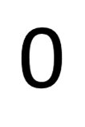
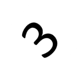
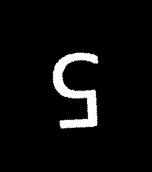

### HW3. Digit Recognizer

In this code we try to find digit value from it's rotated and scaled image. \
here are some examples
  

#### Steps to solve the problem
1. Recognize the biggest contour
    in order to find the biggers contour I put a threshold on picure and used BINARY_INV to have the number white.\
    
    
    ```
    gray_image = cv2.cvtColor(image, cv2.COLOR_BGR2GRAY)
    _, thresh = cv2.threshold(gray_image, 80, 255, cv2.THRESH_BINARY_INV)
    contours, _ = cv2.findContours(thresh, cv2.RETR_TREE, cv2.CHAIN_APPROX_SIMPLE)
    if len(contours) == 0:
        return -1
    number = max(contours, key=cv2.contourArea)
    ```

2. Find angle of number and rotate it
    to rotate the image I used minAreaRect to find the best fitted recangle and then rotate it with that angle.\
    \
    *as you see it may be rotated upside down*
    ```
    (x, y), (width, height), degree = cv2.minAreaRect(number)
    thresh = imutils.rotate(thresh, degree)
    ```

3. Crop and resize the number
    after rotating the number i find biggest contour again to crop the number to the fit size, then resized it to 120x180, because my masks were also resized at this size.\
    \
    *is it a six or an upside down nine? I don't know too*
    ```
    contours, _ = cv2.findContours(thresh, cv2.RETR_TREE, cv2.CHAIN_APPROX_SIMPLE)
    number = max(contours, key=cv2.contourArea)
    x, y, w, h = cv2.boundingRect(number)
    thresh = thresh[y: y + h, x: x+w]
    if h < w:
        thresh = imutils.rotate_bound(thresh, 90)
    ```

4. Compare with masks
    to find out the number, I compared the cropped result with all numbers masks. in order to do this i used bitwise and, then i counted white pixels, maximum number is the answer!
    *i compared any mask with cropped number and 180 degrees rotated one to have the best guess of answer.*
    ```
    number = cv2.resize(image_preproccess(image), (120, 180))
    number_reverse = imutils.rotate_bound(number, 180)
    max_count, max_index = 0, 0
    for index, mask in enumerate(number_masks):
        for num in (number, number_reverse):
            masked_img = cv2.bitwise_and(num, mask)
            tmp_count = np.count_nonzero(masked_img)
            if tmp_count > max_count:
                max_count = tmp_count
                max_index = index
    return max_index

    ```

And these are my results.
```
0.PNG => 0      0_2.PNG => 0    0_3.PNG => 0    0_4.PNG => 0    
1.PNG => 1      1_2.PNG => 1    1_3.PNG => 1    1_4.PNG => 1    
2.PNG => 2      2_2.PNG => 2    2_3.PNG => 2    2_4.PNG => 2    
3.PNG => 3      3_2.PNG => 3    3_3.PNG => 3    3_4.PNG => 3    
4.PNG => 4      4_2.PNG => 4    4_3.PNG => 4    4_4.PNG => 4    
5.PNG => 5      5_2.PNG => 5    5_3.PNG => 5    5_4.PNG => 5    
6.PNG => 6      6_2.PNG => 6    6_3.PNG => 6    6_4.PNG => 9    
7.PNG => 7      7_2.PNG => 7    7_3.PNG => 7    7_4.PNG => 7    
8.PNG => 8      8_2.PNG => 8    8_3.PNG => 8    8_4.PNG => 8    
9.PNG => 9      9_2.PNG => 9    9_3.PNG => 9    9_4.PNG => 9
```
__first column is my mask pictures__

#### Test code
You can run my code as bellow:
`python3 digit_recognizer.py path/to/image.png`
and the result will be a number
